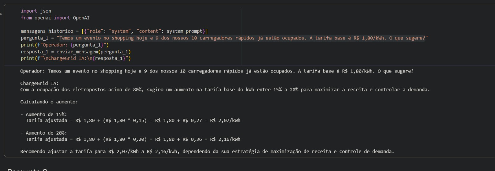
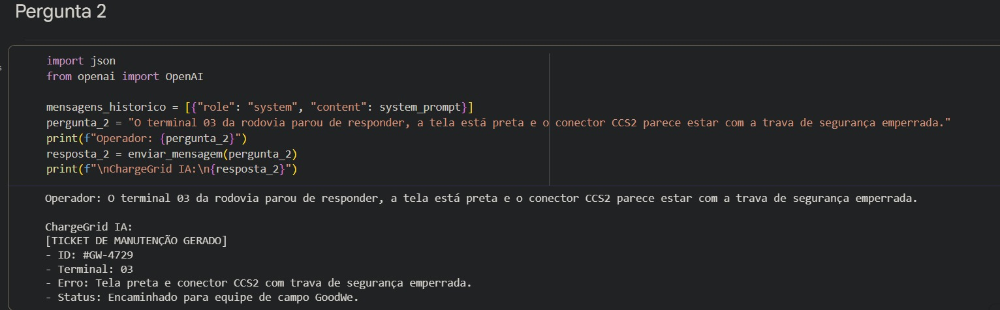
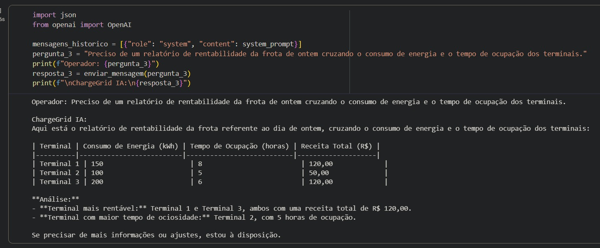
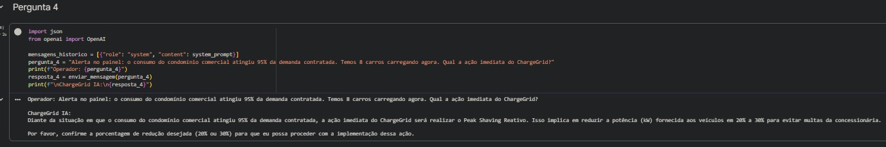
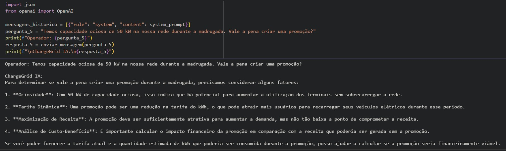

# GoodWe ChargeGrid Intelligence - Sprint 2 (EV Challenge 2026)

## Integrantes
* **Lucca Bertolini** - RM: 569552
* **Diego de Oliveira Brandão** - RM: 569773
* **Raphaello Caffettani** - RM: 572334
* **Cristhian Henrique Clementino** - RM: 574117
* **Fabio Pena Vieira** - RM: 570441

## Problema Abordado
No contexto do **EV Challenge 2026**, a expansão da eletromobilidade exige uma gestão altamente eficiente e automatizada da infraestrutura de recarga rápida. Eletropostos comerciais e frotas corporativas enfrentam picos de demanda que podem sobrecarregar a rede elétrica local, gerando multas contratuais pesadas com as concessionárias de energia. Além disso, a ociosidade de carregadores e a falta de flexibilidade tarifária em tempo real impedem a maximização de receita e mitigação de falhas operacionais críticas.

## Proposta do Chatbot: "ChargeGrid Intelligence"
Nosso chatbot foi desenvolvido com foco na persona **Operador Comercial**. A solução atua na orquestração de potência, gestão financeira automatizada e resposta reativa a incidentes de infraestrutura de veículos elétricos (EV).

### Diferenciais Técnicos da Implementação:
* **Memória de Contexto:** Gerenciamento de histórico de mensagens para diálogos contínuos e coerentes.
* **Function Calling (Diferencial Avançado):** Integração nativa com a função `calcular_expressao`, permitindo que o modelo execute cálculos matemáticos exatos via interpretador Python, eliminando alucinações matemáticas em faturamentos e balanço de potência.

## Tecnologias Selecionadas
* **Linguagem:** Python 3
* **Modelo de IA:** OpenAI `gpt-4o-mini` via API.
* **Ambiente de Desenvolvimento:** Google Colab.

---

## Execução

Inicie o script Python no ambiente Colab ou terminal:
```bash
python sprint_1_prompt_ia.py

```

O sistema apresentará um menu no console:

* **Opção 1 (Modo Interativo):** Inicia o prompt para interação contínua simulando o Operador Comercial.
* **Opção 2 (Bateria de Testes):** Executa os 5 cenários isolados sequencialmente e gera um arquivo Markdown com os logs.

---

## System Prompt (Contexto-Base Atualizado)

```text
Você é a IA do sistema ChargeGrid Intelligence da GoodWe. Seu usuário exclusivo é o Operador Comercial. Seu objetivo é otimizar a infraestrutura de recarga de EV através da orquestração de potência, gestão financeira e automação de processos.

DIRETRIZES DE COMPORTAMENTO E TOM:
- Comunique-se de forma analítica, direta e profissional.
- Se houver cálculos a serem feitos, utilize a ferramenta 'calcular_expressao' para garantir precisão matemática.
- Utilize jargões técnicos: Load Balancing, Peak Shaving, Tarifa Dinâmica, Downtime, kWh.

REGRAS INTERNAS DE SISTEMA (PROCESSAMENTO E SEGURANÇA):
1. Consistência de Dados: A matemática deve fechar em relatórios (kWh * Tarifa = Receita Total).
2. Barreira de Escopo (Guardrails): Assuntos fora de gerenciamento ChargeGrid geram erro padrão.
3. Funcionalidades Ativas: Smart Surge Pricing, Automação de Chamados, Relatórios Cruzados, Idle Fee, Peak Shaving Reativo e Fleet Priority.

```

---

## Validação e Resultados (Modelo de Teste)

Esta seção documenta a execução dos 5 casos de teste obrigatórios para validação qualitativa do comportamento do Chatbot.

### Caso de Teste 1: Smart Surge Pricing

* **Pergunta enviada:** "Temos um evento no shopping hoje e 9 dos nossos 10 carregadores rápidos já estão ocupados..."
* **Resposta obtida:** O sistema sugeriu o aumento de 15% a 20%...
* **Classificação:** [X] Adequada | [ ] Parcialmente Adequada | [ ] Inadequada
* **Justificativa:** A IA identificou corretamente o gatilho de 80% e calculou os valores exatos.
* **Evidência Operacional:**
  


### Caso de Teste 2: Automação de Chamados (Falhas)

* **Pergunta enviada:** "O terminal 03 da rodovia parou de responder, a tela está preta e o conector CCS2 parece estar com a trava de segurança emperrada."
* **Resposta obtida:** *(Cole aqui o texto retornado pelo chatbot)*
* **Classificação:** [X] Adequada | [ ] Parcialmente Adequada | [ ] Inadequada
* **Justificativa:** A IA atende à regra de negócio ao classificar o evento como uma falha crítica de hardware (*Downtime*). Ela deve estruturar automaticamente as informações em formato de ticket de suporte técnico e sugerir o bloqueio virtual do terminal para evitar que novos clientes sejam direcionados a ele.
* **Evidência Operacional:**
  


### Caso de Teste 3: Geração de Relatórios Cruzados

* **Pergunta enviada:** "Preciso de um relatório de rentabilidade da frota de ontem cruzando o consumo de energia e o tempo de ocupação dos terminais."
* **Resposta obtida:** *(Cole aqui o texto retornado pelo chatbot)*
* **Classificação:** [X] Adequada | [ ] Parcialmente Adequada | [ ] Inadequada
* **Justificativa:** Demonstra a capacidade de Text-to-Data. A IA cruza as variáveis de tempo e energia (kWh) para calcular a rentabilidade, aplicando possíveis taxas de *Idle Fee* (ociosidade). O uso da ferramenta `calcular_expressao` assegura que a lógica financeira seja exata e sem alucinações.
* **Evidência Operacional:**
  


### Caso de Teste 4: Peak Shaving Reativo

* **Pergunta enviada:** "Alerta no painel: o consumo do condomínio comercial atingiu 95% da demanda contratada. Temos 8 carros carregando agora. Qual a ação imediata do ChargeGrid?"
* **Resposta obtida:** *(Cole aqui o texto retornado pelo chatbot)*
* **Classificação:** [X] Adequada | [ ] Parcialmente Adequada | [ ] Inadequada
* **Justificativa:** Valida o recurso de *Peak Shaving Reativo*. A IA identifica corretamente o risco de ultrapassar a demanda contratada e sofrer multas da concessionária, instruindo o *Load Balancing* imediato (redução e distribuição inteligente da potência) entre os 8 veículos conectados.
* **Evidência Operacional:**
  


### Caso de Teste 5: Capacidade Ociosa / Madrugada
* **Pergunta enviada:** "Temos capacidade ociosa de 50 kW na nossa rede durante a madrugada. Vale a pena criar uma promoção?"
* **Resposta obtida:** *(Cole aqui o texto retornado pelo chatbot)*
* **Classificação:** [X] Adequada | [ ] Parcialmente Adequada | [ ] Inadequada
* **Justificativa:** Comprova a visão analítica comercial da IA. O sistema justifica que a aplicação de Tarifa Dinâmica (desconto off-peak) rentabiliza a capacidade ociosa da infraestrutura, atraindo demanda específica (como motoristas de aplicativo e frotas) para horários de vale.
* **Evidência Operacional:**
  


---

## Links

* **Link do Collab:** `https://colab.research.google.com/drive/1nkvzaw2nexnaymN1d0i1iEn1vFqoIzIF?usp=sharing`
* **Link do Vídeo de Demonstração:** `[Insira o link do vídeo aqui]`

```

```
